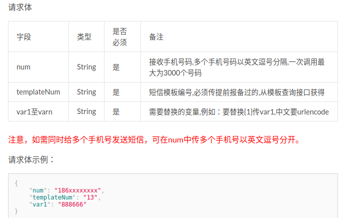
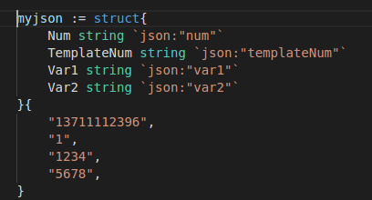

# SMS and WebCall
### API
[API](https://api497.docs.apiary.io/#)

### 请求body实例


### 短信模板:
```
{
      "_id": "N00000015110_1",
      "name": "邀请码",
      "content": "您好，您的信息已经被录入广州市民兵应急指挥平台，请搜索微信公众号{1}并关注，关注后请输入邀请码{2}完成身份绑定。请勿泄露您的邀请码！",
      "num": "1",
      "vars": 2,
      "sign": "【广州市民兵应急指挥平台】"
    },
    {
      "_id": "N00000015110_2",
      "name": "初始账号密码",
      "content": "您好，您被设置为广州市民兵应急指挥平台中所在单位{1}的负责人，有权登录并使用系统，系统网址为{2}，登录账号为{3}，初始密码为{4}，请尽快登录并修改密码。",
      "num": "2",
      "vars": 4,
      "sign": "【广州市民兵应急指挥平台】"
    },
    {
      "_id": "N00000015110_3",
      "name": "集合通知",
      "content": "您好，民兵紧急集合通知，发送单位{1}，集合地点{2}，集合事由{3}，请您收到消息后查看微信公众号通知详情，并且迅速前往集合地点。",
      "num": "3",
      "vars": 3,
      "sign": "【广州市民兵应急指挥平台】"
    },
    {
      "_id": "N00000015110_4",
      "name": "点名通知",
      "content": "您好，{1}点名通知，发送单位{2}，点名通知内容{3}，请您查看微信公众号点名通知进行响应。",
      "num": "4",
      "vars": 3,
      "sign": "【广州市民兵应急指挥平台】"
    },
    {
      "_id": "N00000015110_5",
      "name": "回执消息",
      "content": "您好，{1}回执消息，发送单位{2}，通知内容{3}，请您查看微信公众号回执消息并及时回复。",
      "num": "5",
      "vars": 3,
      "sign": "【广州市民兵应急指挥平台】"
    },
    {
      "_id": "N00000015110_6",
      "name": "一般消息",
      "content": "您好，{1}消息通知，发送单位{2}，通知内容{3}，请您查看微信公众号消息通知。",
      "num": "6",
      "vars": 3,
      "sign": "【广州市民兵应急指挥平台】"
    }
```
### 语音模板Variable字段:
role:1 </br>
日常工作通知,打开微信公众号查看通知详情 </br>
role:2 </br>
集合通知,打开微信公众号查看通知详情 </br>
